# 开发文档

------

## 1	配置类问题

### 1	IDEA

#### 1	设置默认maven

> 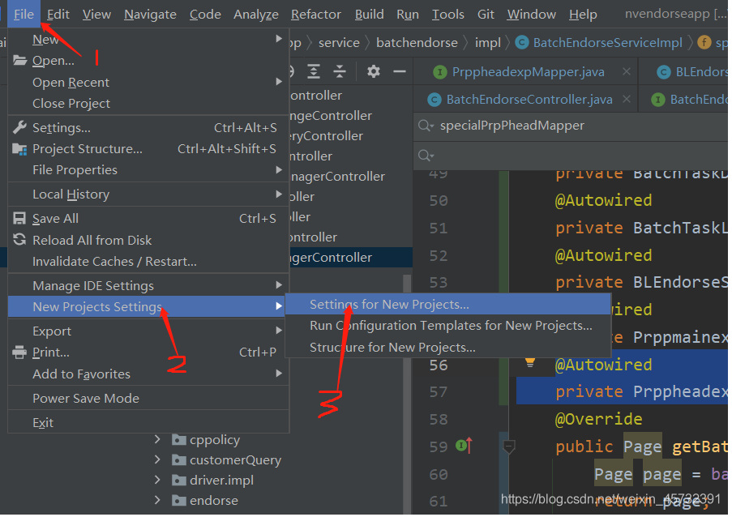
>
> [IDEA设置默认的maven配置_KGF886的博客-CSDN博客](https://blog.csdn.net/weixin_45732391/article/details/118719802)

#### 2	无效的源发行版

> 新建项目后，运行时总会报错：
>
> ​	java: 错误: 无效的源发行版：17
>
> 原因：jdk版本环境不一致
>
> ！！！！！！！！！！！！请先跳过1，先看后面的解决办法！！！！！！！！！！！！！！！
>
> 解决方法：1	查看运行环境---设置为jdk8（跟安装的jdk一致即可）
>
> 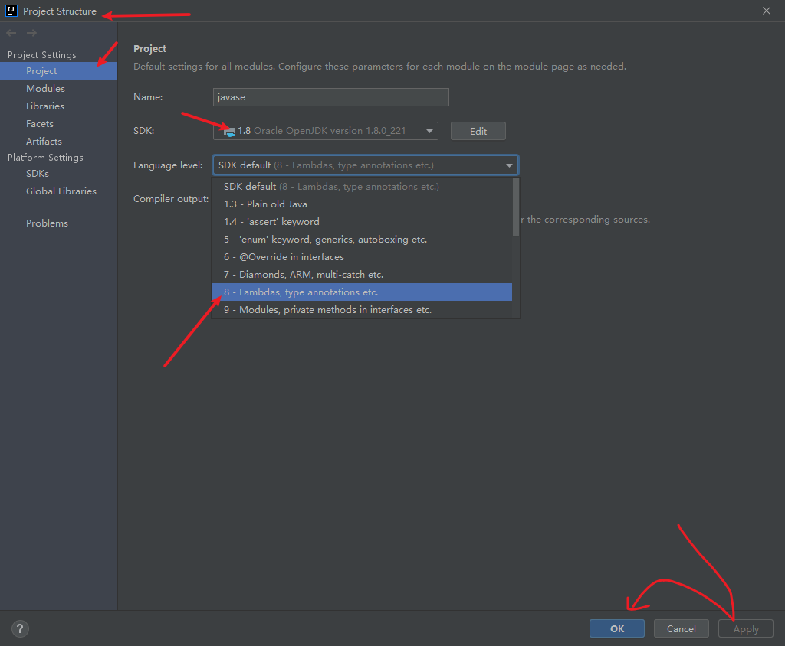
>
> Modules里也要检查：
>
> 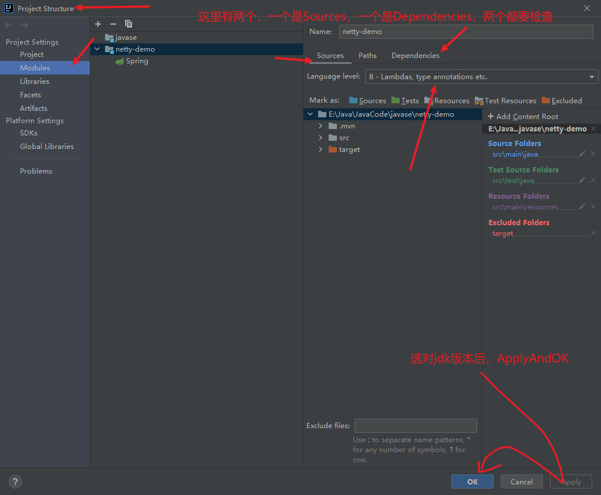
>
> 最后还有Settings里面
>
> 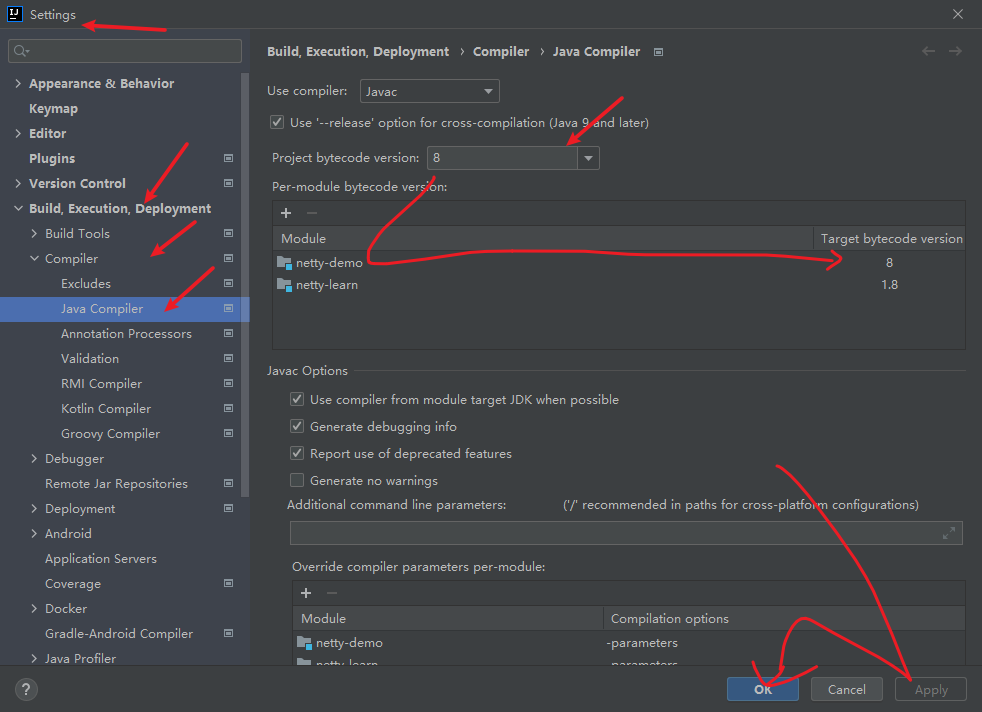
>
> 修改完成后，还是会报以下的错误：
>
> 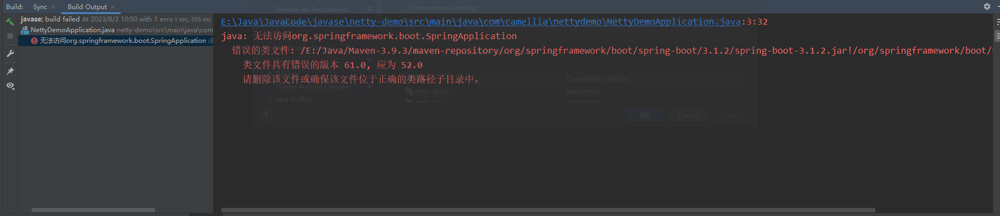
>
> ```
> java: 无法访问org.springframework.boot.SpringApplication
>   错误的类文件: /E:/Java/Maven-3.9.3/maven-repository/org/springframework/boot/spring-boot/3.1.2/spring-boot-3.1.2.jar!/org/springframework/boot/SpringApplication.class
>     类文件具有错误的版本 61.0, 应为 52.0
>     请删除该文件或确保该文件位于正确的类路径子目录中。
> ```
>
> 原因：还是因为JDK版本的问题
>
> 2	后面发现，其实SpringBoot的版本与JDK的版本需要对应。
>
> 即，**SpringBoot3.x需要JDK17支持**。
>
> 所以，如果安装的JDK版本为JDK8，那新建SpringBoot项目时需选择3.0以下的版本。
>
> 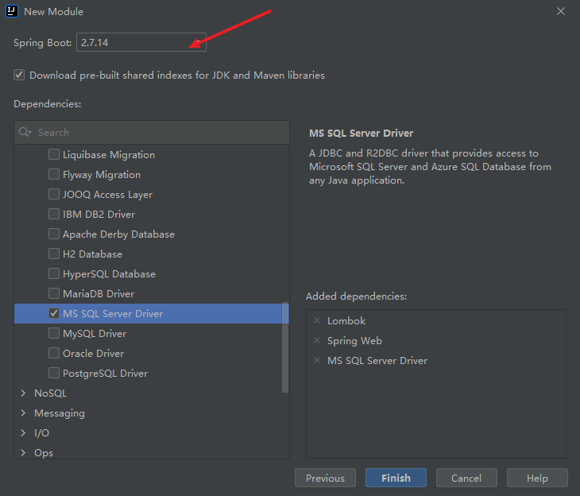
>
> [SpringBoot版本与JDK版本的对应关系_springboot和jdk版本对应_瞧！是小菜鸡啊的博客-CSDN博客](https://blog.csdn.net/qq_40528266/article/details/129120506?ops_request_misc=&request_id=&biz_id=102&utm_term=springboot3.0以上需要用jdk17吗&utm_medium=distribute.pc_search_result.none-task-blog-2~all~sobaiduweb~default-0-129120506.142^v92^chatgptT0_1&spm=1018.2226.3001.4187)
>
> [java: 错误: 无效的源发行版:17_G666666_的博客-CSDN博客](https://blog.csdn.net/G666666_/article/details/128127980?ops_request_misc=&request_id=&biz_id=102&utm_term=java: 错误: 无效的源发行版：17&utm_medium=distribute.pc_search_result.none-task-blog-2~all~sobaiduweb~default-0-128127980.nonecase&spm=1018.2226.3001.4187)
>
> [java: 无法访问org.springframework.boot.SpringApplication_JavaWizard-M的博客-CSDN博客](https://blog.csdn.net/java_cpp_/article/details/130728369?ops_request_misc=&request_id=&biz_id=102&utm_term=java: 无法访问org.springframework.&utm_medium=distribute.pc_search_result.none-task-blog-2~all~sobaiduweb~default-0-130728369.142^v92^chatgptT0_1&spm=1018.2226.3001.4187)

#### 3	idea过期解决办法

> 日期：20230821
>
> 根据以下网址来解决，可以使用它提供的激活码，也可以一劳永逸破解。
>
> [Intellij IDEA 2021.2 重置试用 详细教程 - 谭贰 - 博客园 (cnblogs.com)](https://www.cnblogs.com/540X/p/16074571.html)

#### 4	启动报错

> ```
> Module 'xiaozhi-web-java' production: java.lang.IllegalArgumentException: Argument for @NotNull parameter 'path' of org/jetbrains/jps/incremental/relativizer/PathRelativizerService.toFull must not be null
> 
> 
> 
> Module 'xiaozhi-web-java' tests: java.lang.RuntimeException: java.lang.NullPointerException
> ```
>
> 


### 2	MySQL

####  1	GroupBy报错

> 项目：小智校园后端——查询课堂问答		日期：20230805
>
> 报错：
>
> ```
> [Err] 1055 - Expression #1 of ORDER BY clause is not in GROUP BY
> clause and contains nonaggregated column
> 'information_schema.PROFILING.SEQ' which is not functionally dependent
> on columns in GROUP BY clause; this is incompatible with
> sql_mode=only_full_group_by
> 
> ```
>
> 原因：mysql 5.7+中 默认启用了 ONLY_FULL_GROUP_BY
>
> 解决：
>
> ​	降低数据库版本
>
> ​	把该模式去掉
>
> 详细请看：[解决 Cause: java.sql.SQLSyntaxErrorException: Expression #1 of SELECT list is not in GROUP BY错误_.sqlsyntaxerrorexception: expression #1 of order b_spring_0110的博客-CSDN博客](https://blog.csdn.net/Seven_0110/article/details/112356269)
>
> 

## 2	操作类问题

### 1	Git

#### 1	commit注意事项

> 提交至远程仓库的时候，请检查所提交的代码是否含有除了pom.xml和yml的配置类文件。如果有，请选择忽略提交。提交的代码一般只包括：
>
> .java	.xml	.yml

#### 2	IDEA没有	Local Changes	的解决办法

> 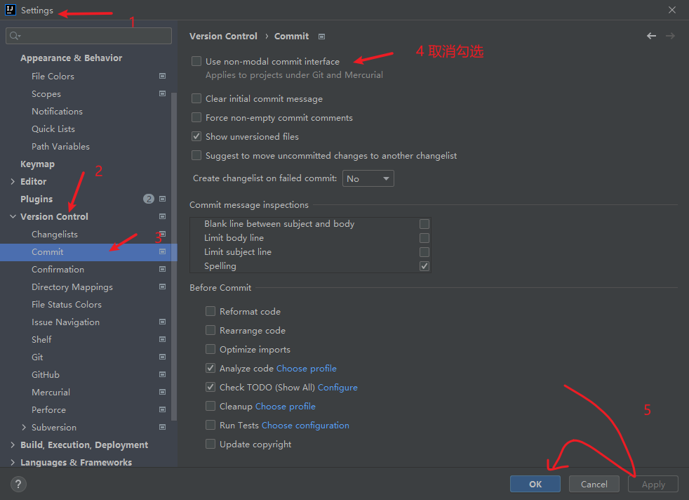
>
> 作用为：实时看到修改了哪些代码
>
> 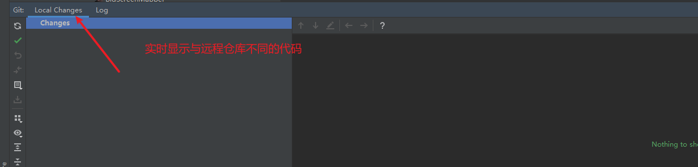
>
> [解决idea 中 git 无 Local Changes_git local changes_Miracle8998的博客-CSDN博客](https://blog.csdn.net/m0_64054994/article/details/121492426?ops_request_misc=%7B%22request%5Fid%22%3A%22169094938016800182112355%22%2C%22scm%22%3A%2220140713.130102334..%22%7D&request_id=169094938016800182112355&biz_id=0&utm_medium=distribute.pc_search_result.none-task-blog-2~all~sobaiduend~default-2-121492426-null-null.142^v92^chatgptT0_1&utm_term=idea显示git localchange&spm=1018.2226.3001.4187)

### 2	MySQL

#### 1	关于建表

> 如果只需创建一个或少数的表，直接使用navicat选择新建表即可。此时所创建的表会默认与数据库中的其他表选择相同的引擎，编码。
>
> 如果是创建大量的表，需用到DDL建表语句时，请注意主键的设置以及引擎和编码格式。
>
> 
>
> 有时候如果增加一个字段能完成逻辑实现，就尽量不要另外创建一个表。

#### 2	mysql被锁

> 项目：小智校园管理系统公司数据库		日期：20230808
>
> 报错：
>
> 连接mysql提示被锁,“Host ‘xx‘ is blocked because of many connection errors； unblock with ‘mysqladmin ...“
>
> 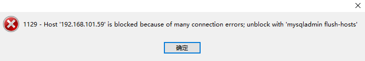
>
> 原因：同一个ip在短时间内产生太多（超过mysql数据库max_connection_errors的最大值）[中断](https://so.csdn.net/so/search?q=中断&spm=1001.2101.3001.7020)的数据库连接而导致的阻塞；
>
> 今天使用websocket测试助手的时候，light项目一直报错。可能是没有获取到相关权限。导致主机一直请求然后地址被锁。
>
> 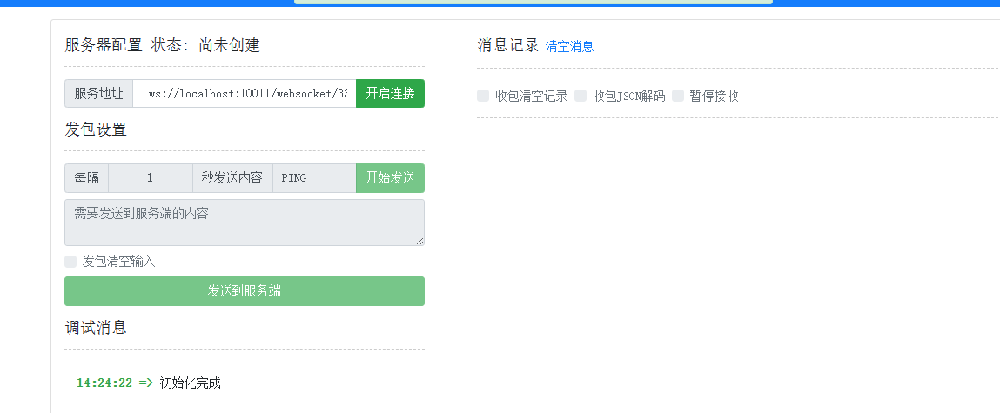
>
> 解决：（已解决）
>
> （最简单的办法）可以在另一个连的上的电脑上，进navicat软件在这个库下输 flush hosts这个命令就好了
>
> 参考：
>
> [连接mysql提示被锁,“Host ‘xx‘ is blocked because of many connection errors； unblock with ‘mysqladmin ...“_连接数据库提升被锁_大宝and小宝的博客-CSDN博客](https://blog.csdn.net/hailishen/article/details/127915511)
>
> [mysql连接1129错误Host is blocked because of many connection errors; unblock with 'mysqladmin flush-host'_kaqiyu_wry的博客-CSDN博客](https://blog.csdn.net/weixin_44091482/article/details/101266067?spm=1001.2101.3001.6650.6&utm_medium=distribute.pc_relevant.none-task-blog-2~default~BlogCommendFromBaidu~Rate-6-101266067-blog-127915511.235^v38^pc_relevant_anti_t3&depth_1-utm_source=distribute.pc_relevant.none-task-blog-2~default~BlogCommendFromBaidu~Rate-6-101266067-blog-127915511.235^v38^pc_relevant_anti_t3&utm_relevant_index=13)

### 3	IDEA

#### 1	删除无用文件

> 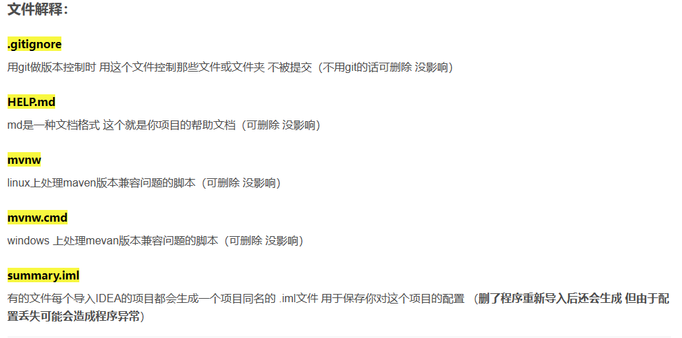
>
> 原文链接：
>
> [Idea创建项目哪些文件可以删除_idea项目的ehcache包用不用删掉_--只因--的博客-CSDN博客](https://blog.csdn.net/G823909/article/details/128162177?ops_request_misc=%7B%22request%5Fid%22%3A%22169102967016800182799731%22%2C%22scm%22%3A%2220140713.130102334.pc%5Fall.%22%7D&request_id=169102967016800182799731&biz_id=0&utm_medium=distribute.pc_search_result.none-task-blog-2~all~first_rank_ecpm_v1~rank_v31_ecpm-2-128162177-null-null.142^v92^chatgptT0_1&utm_term=idea项目中有哪些是可以删除的&spm=1018.2226.3001.4187)

#### 2	mybatisX插件

> 日期：20230809
>
> 操作：创建mapper接口后，要先alt+enter，创建xml文件，再写接口方法进行alt+enter然后才能自动创建sql语句


## 3	代码报错类问题

### 1	IDEA

#### 1	提示:Some classes have changed message

> IDEA报错： Some classes have changed message
>
> 解决办法：查找是否在IDEA中有其他的debug程序在运行，有的话关掉即可。
>
> [【Error】IDEA报错： Some classes have changed message_some classes has_think_ycx的博客-CSDN博客](https://blog.csdn.net/think_ycx/article/details/105809662)

#### 2	FileInputStream读取不到文件的内容

> 原因：文件路径错误。在工程下的Module，文件路径需要加上模块名
>
> 解决办法：加上即可
>
> [IDEA FileInputStream 读取文件路径_inputstream获取文件路径_LiQiang33的博客-CSDN博客](https://blog.csdn.net/qq_44776065/article/details/116125409?ops_request_misc=&request_id=&biz_id=102&utm_term=FileInputStream文件路径&utm_medium=distribute.pc_search_result.none-task-blog-2~all~sobaiduweb~default-1-116125409.142^v92^chatgptT0_1&spm=1018.2226.3001.4187)

#### 3	提示：Manage multiple Spring Boot run configurations in the Services tool window

> Manage multiple Spring Boot run configurations in the Services tool window
> 这句话翻译过来是
> 是否要在Services工具窗口中管理多个Spring Boot运行配置
>
> 选择**Use Services**即可
>
> 开启后：
>
> 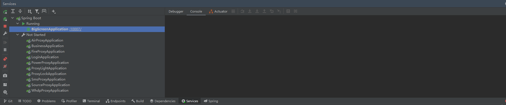
>
> 这样便于管理并发项目
>
> [开启Services工具窗口管理多个Spring Boot项目_manage multiple spring boot run configurations in _拉面牛奶的博客-CSDN博客](https://blog.csdn.net/qq_39505065/article/details/127213633)
>
> 

#### 4	数据库连接失误

> 报错：
>
> ```
> com.mysql.jdbc.exceptions.jdbc4.CommunicationsException: Communications link failure
> 
> The last packet successfully received from the server was 1,005 milliseconds ago.  The last packet sent successfully to the server was 1,005 milliseconds ago.
> 	at sun.reflect.NativeConstructorAccessorImpl.newInstance0(Native Method) ~[na:1.8.0_221]
> 	at sun.reflect.NativeConstructorAccessorImpl.newInstance(NativeConstructorAccessorImpl.java:62) ~[na:1.8.0_221]
> 	at sun.reflect.DelegatingConstructorAccessorImpl.newInstance(DelegatingConstructorAccessorImpl.java:45) ~[na:1.8.0_221]
> 	at java.lang.reflect.Constructor.newInstance(Constructor.java:423) ~[na:1.8.0_221]
> 
> Caused by: java.net.SocketTimeoutException: Read timed out
> 
> ```
>
> 原因：网络问题。百度云下载抢占了网速。
>
> 解决：暂停百度云下载
>
> 

#### 5	maven版本过高，导致非https依赖下载失败

> 项目：小智校园后端代码		日期：20230804
>
> 报错：
>
> ```
> Could not transfer artifact com.oracle:ojdbc6:pom:11.2.0.3 from/to maven-default-http-blocker (http://0.0.0.0/): Blocked mirror for repositories: [public (http://maven.aliyun.com/nexus/content/groups/public/, default, releases+snapshots)]
> ```
>
> ```
> Blocked mirror for repositories: [public (http://maven.aliyun.com/nexus/content/groups/public/, default, releases+snapshots)]
> 
> Since Maven 3.8.1 http repositories are blocked.
> 
> //官方解决问题的方案
> Possible solutions:
> - Check that Maven settings.xml does not contain http repositories
> - Check that Maven pom files not contain http repository http://maven.aliyun.com/nexus/content/groups/public/
> - Add a mirror(s) for http://maven.aliyun.com/nexus/content/groups/public/ that allows http url in the Maven settings.xml
> - Downgrade Maven to version before 3.8.1 in settings
> 
> 
> ```
>
> 原因：1）无法下载依赖包	2）maven3.8以后不支持非https的包下载。
>
> 
>
> 解决办法：尝试过不降maven版本的方法，分别有以下几种方法：
> 让远端仓库支持https
>
> 增加mirror配置：blocked
>
> ```xml
> //为每一个非http源增加如下mirror配置（源比较多的话会比较麻烦）
> <mirror>
>   <id>insecure-repo</id>
>   <mirrorOf>external:http:*</mirrorOf>
>   <url>http://www.ebi.ac.uk/intact/maven/nexus/content/repositories/ebi-repo/</url>
>   <blocked>false</blocked>
> </mirror>
> 
> //注释掉默认配置文件$MAVEN_HOME/conf/settings.xml中的相关block设置
> <mirror>
>  <id>maven-default-http-blocker</id>
>  <mirrorOf>external:http:*</mirrorOf>
>  <name>Pseudo repository to mirror external repositories initially using HTTP.</name>
>  <url>http://0.0.0.0/</url>
>  <blocked>true</blocked>
> </mirror>
> 
> //使用dummy镜像覆盖掉默认配置中的镜像配置（这也是我最喜欢的方法）。在~/.m2/settings.xml中添加如下mirror配置
>  <mirror>
>    <id>maven-default-http-blocker</id>
>    <mirrorOf>external:dummy:*</mirrorOf>
>    <name>Pseudo repository to mirror external repositories initially using HTTP.</name>
>    <url>http://0.0.0.0/</url>
>    <blocked>true</blocked>
>  </mirror>
> 
> ```
>
> 尝试过这些方法，都不生效。
>
> 选择把maven版本降低到3.6，问题解决。
>
> [idea报错Since Maven 3.8.1 http repositories are blocked_since maven 3.8.1 http repositories are blocked._Baron keller的博客-CSDN博客](https://blog.csdn.net/Mrzhang567/article/details/127010998)
>
> [Maven “Blocked mirror for repositories” 错误解决办法_blocked mirror for repositories:_Code Talk的博客-CSDN博客](https://blog.csdn.net/loushuai/article/details/124182904?ops_request_misc=%7B%22request%5Fid%22%3A%22169113391416800222826582%22%2C%22scm%22%3A%2220140713.130102334..%22%7D&request_id=169113391416800222826582&biz_id=0&utm_medium=distribute.pc_search_result.none-task-blog-2~all~baidu_landing_v2~default-2-124182904-null-null.142^v92^chatgptT0_1&utm_term=Blocked mirror for repositories%3A [public (http%3A%2F%2Fmaven.aliyun.com%2Fnexus%2Fcontent%2Fgroups%2Fpublic%2F%2C default%2C releases%2Bsnapshots)]&spm=1018.2226.3001.4187)
>
> 

#### 6 虚拟机栈内存溢出

> 项目：小智校园后端代码	日期：20230805
>
> 报错：
>
> ```
> 023-09-05 21:10:43.822 [http-nio-8088-exec-27] ERROR io.renren.common.exception.RRExceptionHandler - Handler dispatch failed; nested exception is java.lang.OutOfMemoryError: Java heap space
> org.springframework.web.util.NestedServletException: Handler dispatch failed; nested exception is java.lang.OutOfMemoryError: Java heap space
>         at org.springframework.web.servlet.DispatcherServlet.doDispatch(DispatcherServlet.java:1055)
>         at org.springframework.web.servlet.DispatcherServlet.doService(DispatcherServlet.java:943)
>         at org.springframework.web.servlet.FrameworkServlet.processRequest(FrameworkServlet.java:1006)
>         at org.springframework.web.servlet.FrameworkServlet.doPost(FrameworkServlet.java:909)
>         at javax.servlet.http.HttpServlet.service(HttpServlet.java:660)
>         at org.springframework.web.servlet.FrameworkServlet.service(FrameworkServlet.java:883)
>         at javax.servlet.http.HttpServlet.service(HttpServlet.java:741)
>         at org.apache.catalina.core.ApplicationFilterChain.internalDoFilter(ApplicationFilterChain.java:231)
>         at org.apache.catalina.core.ApplicationFilterChain.doFilter(ApplicationFilterChain.java:166)
>         at org.apache.tomcat.websocket.server.WsFilter.doFilter(WsFilter.java:53)
>         at org.apache.catalina.core.ApplicationFilterChain.internalDoFilter(ApplicationFilterChain.java:193)
>         at org.apache.catalina.core.ApplicationFilterChain.doFilter(ApplicationFilterChain.java:166)
>         at org.apache.shiro.web.servlet.OncePerRequestFilter.doFilter(OncePerRequestFilter.java:112)
>         at org.apache.catalina.core.ApplicationFilterChain.internalDoFilter(ApplicationFilterChain.java:193)
>         at org.apache.catalina.core.ApplicationFilterChain.doFilter(ApplicationFilterChain.java:166)
>         at io.renren.common.xss.XssFilter.doFilter(XssFilter.java:23)
>         at org.apache.catalina.core.ApplicationFilterChain.internalDoFilter(ApplicationFilterChain.java:193)
>         at org.apache.catalina.core.ApplicationFilterChain.doFilter(ApplicationFilterChain.java:166)
>         at org.apache.shiro.web.servlet.ProxiedFilterChain.doFilter(ProxiedFilterChain.java:61)
>         at org.apache.shiro.web.servlet.AdviceFilter.executeChain(AdviceFilter.java:108)
>         at org.apache.shiro.web.servlet.AdviceFilter.doFilterInternal(AdviceFilter.java:137)
>         at org.apache.shiro.web.servlet.OncePerRequestFilter.doFilter(OncePerRequestFilter.java:125)
>         at org.apache.shiro.web.servlet.ProxiedFilterChain.doFilter(ProxiedFilterChain.java:66)
>         at org.apache.shiro.web.servlet.AbstractShiroFilter.executeChain(AbstractShiroFilter.java:449)
>         at org.apache.shiro.web.servlet.AbstractShiroFilter$1.call(AbstractShiroFilter.java:365)
>         at org.apache.shiro.subject.support.SubjectCallable.doCall(SubjectCallable.java:90)
>         at org.apache.shiro.subject.support.SubjectCallable.call(SubjectCallable.java:83)
>         at org.apache.shiro.subject.support.DelegatingSubject.execute(DelegatingSubject.java:387)
>         at org.apache.shiro.web.servlet.AbstractShiroFilter.doFilterInternal(AbstractShiroFilter.java:362)
>         at org.apache.shiro.web.servlet.OncePerRequestFilter.doFilter(OncePerRequestFilter.java:125)
>         at org.springframework.web.filter.DelegatingFilterProxy.invokeDelegate(DelegatingFilterProxy.java:358)
>         at org.springframework.web.filter.DelegatingFilterProxy.doFilter(DelegatingFilterProxy.java:271)
>         at org.apache.catalina.core.ApplicationFilterChain.internalDoFilter(ApplicationFilterChain.java:193)
>         at org.apache.catalina.core.ApplicationFilterChain.doFilter(ApplicationFilterChain.java:166)
>         at org.springframework.web.filter.RequestContextFilter.doFilterInternal(RequestContextFilter.java:100)
>         at org.springframework.web.filter.OncePerRequestFilter.doFilter(OncePerRequestFilter.java:119)
>         at org.apache.catalina.core.ApplicationFilterChain.internalDoFilter(ApplicationFilterChain.java:193)
>         at org.apache.catalina.core.ApplicationFilterChain.doFilter(ApplicationFilterChain.java:166)
>         at org.springframework.web.filter.FormContentFilter.doFilterInternal(FormContentFilter.java:93)
>         at org.springframework.web.filter.OncePerRequestFilter.doFilter(OncePerRequestFilter.java:119)
>         at org.apache.catalina.core.ApplicationFilterChain.internalDoFilter(ApplicationFilterChain.java:193)
>         at org.apache.catalina.core.ApplicationFilterChain.doFilter(ApplicationFilterChain.java:166)
>         at org.springframework.web.filter.CharacterEncodingFilter.doFilterInternal(CharacterEncodingFilter.java:201)
>         at org.springframework.web.filter.OncePerRequestFilter.doFilter(OncePerRequestFilter.java:119)
>         at org.apache.catalina.core.ApplicationFilterChain.internalDoFilter(ApplicationFilterChain.java:193)
>         at org.apache.catalina.core.ApplicationFilterChain.doFilter(ApplicationFilterChain.java:166)
>         at org.apache.catalina.core.StandardWrapperValve.invoke(StandardWrapperValve.java:202)
>         at org.apache.catalina.core.StandardContextValve.invoke(StandardContextValve.java:96)
>         at org.apache.catalina.authenticator.AuthenticatorBase.invoke(AuthenticatorBase.java:541)
>         at org.apache.catalina.core.StandardHostValve.invoke(StandardHostValve.java:139)
>         at org.apache.catalina.valves.ErrorReportValve.invoke(ErrorReportValve.java:92)
>         at org.apache.catalina.core.StandardEngineValve.invoke(StandardEngineValve.java:74)
>         at org.apache.catalina.connector.CoyoteAdapter.service(CoyoteAdapter.java:343)
>         at org.apache.coyote.http11.Http11Processor.service(Http11Processor.java:367)
>         at org.apache.coyote.AbstractProcessorLight.process(AbstractProcessorLight.java:65)
>         at org.apache.coyote.AbstractProtocol$ConnectionHandler.process(AbstractProtocol.java:860)
>         at org.apache.tomcat.util.net.NioEndpoint$SocketProcessor.doRun(NioEndpoint.java:1598)
>         at org.apache.tomcat.util.net.SocketProcessorBase.run(SocketProcessorBase.java:49)
>         at java.util.concurrent.ThreadPoolExecutor.runWorker(ThreadPoolExecutor.java:1149)
>         at java.util.concurrent.ThreadPoolExecutor$Worker.run(ThreadPoolExecutor.java:624)
>         at org.apache.tomcat.util.threads.TaskThread$WrappingRunnable.run(TaskThread.java:61)
>         at java.lang.Thread.run(Thread.java:750)
> Caused by: java.lang.OutOfMemoryError: Java heap space
> ```
>
> 原因：学生端提交报告时产生，具体原因不明
>
> 解决方法：重启。docker restart（治标）

#### 7 提交按钮，组队按钮不显示

> 项目：小智校园后端代码	日期：20230805
>
> 报错：无；学生端无法提交报告，组队等操作。
>
> 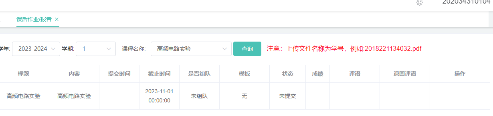
>
> 原因：不明；猜测为后端传参失败，前端未接收相应的参数，需要看前端代码来解决。
>
> 解决方法：暂定
>

#### 8	java栈溢出

> 项目：小智校园后端代码	日期：20230907
>
> 报错：
>
> ```
> 2023-09-07 15:23:05.670 [Finalizer] WARN  org.apache.pdfbox.cos.COSDocument - Warning: You did not close a PDF Document
> 2023-09-07 15:23:05.801 [http-nio-8088-exec-24] ERROR io.renren.common.exception.RRExceptionHandler - Handler dispatch failed; nested exception is java.lang.OutOfMemoryError: Java heap space
> org.springframework.web.util.NestedServletException: Handler dispatch failed; nested exception is java.lang.OutOfMemoryError: Java heap space
>         at org.springframework.web.servlet.DispatcherServlet.doDispatch(DispatcherServlet.java:1055)
>         at org.springframework.web.servlet.DispatcherServlet.doService(DispatcherServlet.java:943)
>         at org.springframework.web.servlet.FrameworkServlet.processRequest(FrameworkServlet.java:1006)
>         at org.springframework.web.servlet.FrameworkServlet.doPost(FrameworkServlet.java:909)
>         at javax.servlet.http.HttpServlet.service(HttpServlet.java:660)
>         at org.springframework.web.servlet.FrameworkServlet.service(FrameworkServlet.java:883)
>         at javax.servlet.http.HttpServlet.service(HttpServlet.java:741)
>         at org.apache.catalina.core.ApplicationFilterChain.internalDoFilter(ApplicationFilterChain.java:231)
>         at org.apache.catalina.core.ApplicationFilterChain.doFilter(ApplicationFilterChain.java:166)
>         at org.apache.tomcat.websocket.server.WsFilter.doFilter(WsFilter.java:53)
>         at org.apache.catalina.core.ApplicationFilterChain.internalDoFilter(ApplicationFilterChain.java:193)
>         at org.apache.catalina.core.ApplicationFilterChain.doFilter(ApplicationFilterChain.java:166)
>         at org.apache.shiro.web.servlet.OncePerRequestFilter.doFilter(OncePerRequestFilter.java:112)
>         at org.apache.catalina.core.ApplicationFilterChain.internalDoFilter(ApplicationFilterChain.java:193)
>         at org.apache.catalina.core.ApplicationFilterChain.doFilter(ApplicationFilterChain.java:166)
>         at io.renren.common.xss.XssFilter.doFilter(XssFilter.java:23)
>         at org.apache.catalina.core.ApplicationFilterChain.internalDoFilter(ApplicationFilterChain.java:193)
>         at org.apache.catalina.core.ApplicationFilterChain.doFilter(ApplicationFilterChain.java:166)
>         at org.apache.shiro.web.servlet.ProxiedFilterChain.doFilter(ProxiedFilterChain.java:61)
>         at org.apache.shiro.web.servlet.AdviceFilter.executeChain(AdviceFilter.java:108)
>         at org.apache.shiro.web.servlet.AdviceFilter.doFilterInternal(AdviceFilter.java:137)
>         at org.apache.shiro.web.servlet.OncePerRequestFilter.doFilter(OncePerRequestFilter.java:125)
>         at org.apache.shiro.web.servlet.ProxiedFilterChain.doFilter(ProxiedFilterChain.java:66)
>         at org.apache.shiro.web.servlet.AbstractShiroFilter.executeChain(AbstractShiroFilter.java:449)
>         at org.apache.shiro.web.servlet.AbstractShiroFilter$1.call(AbstractShiroFilter.java:365)
>         at org.apache.shiro.subject.support.SubjectCallable.doCall(SubjectCallable.java:90)
>         at org.apache.shiro.subject.support.SubjectCallable.call(SubjectCallable.java:83)
>         at org.apache.shiro.subject.support.DelegatingSubject.execute(DelegatingSubject.java:387)
>         at org.apache.shiro.web.servlet.AbstractShiroFilter.doFilterInternal(AbstractShiroFilter.java:362)
>         at org.apache.shiro.web.servlet.OncePerRequestFilter.doFilter(OncePerRequestFilter.java:125)
>         at org.springframework.web.filter.DelegatingFilterProxy.invokeDelegate(DelegatingFilterProxy.java:358)
>         at org.springframework.web.filter.DelegatingFilterProxy.doFilter(DelegatingFilterProxy.java:271)
>         at org.apache.catalina.core.ApplicationFilterChain.internalDoFilter(ApplicationFilterChain.java:193)
>         at org.apache.catalina.core.ApplicationFilterChain.doFilter(ApplicationFilterChain.java:166)
>         at org.springframework.web.filter.RequestContextFilter.doFilterInternal(RequestContextFilter.java:100)
>         at org.springframework.web.filter.OncePerRequestFilter.doFilter(OncePerRequestFilter.java:119)
>         at org.apache.catalina.core.ApplicationFilterChain.internalDoFilter(ApplicationFilterChain.java:193)
>         at org.apache.catalina.core.ApplicationFilterChain.doFilter(ApplicationFilterChain.java:166)
>         at org.springframework.web.filter.FormContentFilter.doFilterInternal(FormContentFilter.java:93)
>         at org.springframework.web.filter.OncePerRequestFilter.doFilter(OncePerRequestFilter.java:119)
>         at org.apache.catalina.core.ApplicationFilterChain.internalDoFilter(ApplicationFilterChain.java:193)
>         at org.apache.catalina.core.ApplicationFilterChain.doFilter(ApplicationFilterChain.java:166)
>         at org.springframework.web.filter.CharacterEncodingFilter.doFilterInternal(CharacterEncodingFilter.java:201)
>         at org.springframework.web.filter.OncePerRequestFilter.doFilter(OncePerRequestFilter.java:119)
>         at org.apache.catalina.core.ApplicationFilterChain.internalDoFilter(ApplicationFilterChain.java:193)
>         at org.apache.catalina.core.ApplicationFilterChain.doFilter(ApplicationFilterChain.java:166)
>         at org.apache.catalina.core.StandardWrapperValve.invoke(StandardWrapperValve.java:202)
>         at org.apache.catalina.core.StandardContextValve.invoke(StandardContextValve.java:96)
>         at org.apache.catalina.authenticator.AuthenticatorBase.invoke(AuthenticatorBase.java:541)
>         at org.apache.catalina.core.StandardHostValve.invoke(StandardHostValve.java:139)
>         at org.apache.catalina.valves.ErrorReportValve.invoke(ErrorReportValve.java:92)
>         at org.apache.catalina.core.StandardEngineValve.invoke(StandardEngineValve.java:74)
>         at org.apache.catalina.connector.CoyoteAdapter.service(CoyoteAdapter.java:343)
>         at org.apache.coyote.http11.Http11Processor.service(Http11Processor.java:367)
>         at org.apache.coyote.AbstractProcessorLight.process(AbstractProcessorLight.java:65)
>         at org.apache.coyote.AbstractProtocol$ConnectionHandler.process(AbstractProtocol.java:860)
>         at org.apache.tomcat.util.net.NioEndpoint$SocketProcessor.doRun(NioEndpoint.java:1598)
>         at org.apache.tomcat.util.net.SocketProcessorBase.run(SocketProcessorBase.java:49)
>         at java.util.concurrent.ThreadPoolExecutor.runWorker(ThreadPoolExecutor.java:1149)
>         at java.util.concurrent.ThreadPoolExecutor$Worker.run(ThreadPoolExecutor.java:624)
>         at org.apache.tomcat.util.threads.TaskThread$WrappingRunnable.run(TaskThread.java:61)
>         at java.lang.Thread.run(Thread.java:750)
> Caused by: java.lang.OutOfMemoryError: Java heap space
> ```
>


```
com.mongodb.MongoSocketOpenException: Exception opening socket
	at com.mongodb.connection.SocketStream.open(SocketStream.java:63) ~[mongo-java-driver-3.4.2.jar:na]
	at com.mongodb.connection.InternalStreamConnection.open(InternalStreamConnection.java:115) ~[mongo-java-driver-3.4.2.jar:na]
	at com.mongodb.connection.DefaultServerMonitor$ServerMonitorRunnable.run(DefaultServerMonitor.java:113) ~[mongo-java-driver-3.4.2.jar:na]
	at java.lang.Thread.run(Thread.java:748) [na:1.8.0_221]
Caused by: java.net.ConnectException: Connection refused: connect
	at java.net.DualStackPlainSocketImpl.waitForConnect(Native Method) ~[na:1.8.0_221]
	at java.net.DualStackPlainSocketImpl.socketConnect(DualStackPlainSocketImpl.java:85) ~[na:1.8.0_221]
	at java.net.AbstractPlainSocketImpl.doConnect(AbstractPlainSocketImpl.java:350) ~[na:1.8.0_221]
	at java.net.AbstractPlainSocketImpl.connectToAddress(AbstractPlainSocketImpl.java:206) ~[na:1.8.0_221]
	at java.net.AbstractPlainSocketImpl.connect(AbstractPlainSocketImpl.java:188) ~[na:1.8.0_221]
	at java.net.PlainSocketImpl.connect(PlainSocketImpl.java:172) ~[na:1.8.0_221]
	at java.net.SocksSocketImpl.connect(SocksSocketImpl.java:392) ~[na:1.8.0_221]
	at java.net.Socket.connect(Socket.java:589) ~[na:1.8.0_221]
	at com.mongodb.connection.SocketStreamHelper.initialize(SocketStreamHelper.java:57) ~[mongo-java-driver-3.4.2.jar:na]
	at com.mongodb.connection.SocketStream.open(SocketStream.java:58) ~[mongo-java-driver-3.4.2.jar:na]
	... 3 common frames omitted
```


### 2	MySQL

#### 1	count与case的整合使用

> 在统计每月报修数的时候，根据处理状态status：1，2，3，分别统计三个数字。
>
> 统计出错：每个结果都统计错误。
>
> ```sql
> //每月的报修数
> SELECT
> 	DATE_FORMAT( ldr.create_time, '%Y-%m' ) AS MONTH,
> 	COUNT( CASE WHEN ldr.status = '1' THEN 1 END ) AS REPAIR,
> 	COUNT( CASE WHEN ldr.status = '2' THEN 1 END ) AS maintenance,
> 	COUNT( CASE WHEN ldr.status = '3' THEN 1 END ) AS scrap 
> FROM
> 	lab_device_report ldr
> 	JOIN school_calendar sc ON ldr.create_time BETWEEN sc.start_date 
> 	AND sc.end_date 
> 	AND sc.school_id = 1
> 	LEFT JOIN lab_device ld ON ld.mac_id = ldr.device_id
> 	LEFT JOIN school_equipment se ON se.ieee = ldr.device_id
> 	LEFT JOIN school_lab sl ON (sl.id = ld.lab_id OR se.room_id )
> WHERE
> 	sl.school_id = 1 
> GROUP BY
> MONTH 
> ORDER BY
> MONTH
> 
> ```
>
> 
>
> 原因：尚不明确。可能是因为null的结果也统计进结果了。
>
> 解决：count()改为sum()，case then 后面，满足条件置为1，不满足条件的话置为0.
>
> ```sql
> SELECT
>     DATE_FORMAT(ldr.create_time, '%Y-%m') AS MONTH,
>     SUM(CASE WHEN ldr.status = '1' THEN 1 ELSE 0 END) AS REPAIR,
>     SUM(CASE WHEN ldr.status = '2' THEN 1 ELSE 0 END) AS maintenance,
>     SUM(CASE WHEN ldr.status = '3' THEN 1 ELSE 0 END) AS scrap
> FROM
>     lab_device_report ldr
>     JOIN school_calendar sc ON ldr.create_time BETWEEN sc.start_date AND sc.end_date AND sc.school_id = 1
>     LEFT JOIN lab_device ld ON ld.mac_id = ldr.device_id
>     LEFT JOIN school_equipment se ON se.ieee = ldr.device_id
>     LEFT JOIN school_lab sl ON (ld.lab_id = sl.id OR se.room_id = sl.id)
> WHERE
>     sl.school_id = 1
> GROUP BY
>     MONTH
> ORDER BY
>     MONTH
> ```
>


## 4	常用配置文档助手

### 1	logback配置

> ```xml
> <?xml version="1.0" encoding="UTF-8"?>
> <!-- 默认为 <configuration scan="true" scanPeriod="60 seconds" debug="false"> -->
> <!-- scan 当此属性设置为true时，配置文件如果发生改变，将会被重新加载，默认值为true -->
> <!-- scanPeriod 设置监测配置文件是否有修改的时间间隔，如果没有给出时间单位，默认单位是毫秒。当scan为true时，此属性生效。默认的时间间隔为1分钟 -->
> <!-- debug 当此属性设置为true时，将打印出logback内部日志信息，实时查看logback运行状态。默认值为false -->
> <configuration>
>     <contextName>myAppName</contextName>
>     <springProperty name="basePath" source="log.path" defaultValue=""/>
> 
>     <!-- 彩色日志依赖的渲染类 -->
>     <conversionRule conversionWord="clr" converterClass="org.springframework.boot.logging.logback.ColorConverter"/>
>     <conversionRule conversionWord="wex"
>                     converterClass="org.springframework.boot.logging.logback.WhitespaceThrowableProxyConverter"/>
>     <conversionRule conversionWord="wEx"
>                     converterClass="org.springframework.boot.logging.logback.ExtendedWhitespaceThrowableProxyConverter"/>
> 
>     <property name="file_pattern"
>               value="%date [%thread] %-5level [%logger{50}] %file:%line - %msg%n"/>
>     <property name="console_pattern"
>               value="${CONSOLE_LOG_PATTERN:-%clr(%d{yyyy-MM-dd HH:mm:ss.SSS}){faint} %clr(${LOG_LEVEL_PATTERN:-%5p}) %clr(${PID:- }){magenta} %clr(---){faint} %clr([%15.15t]){faint} %clr(%-40.40logger{39}){cyan} %clr(:){faint} %m%n${LOG_EXCEPTION_CONVERSION_WORD:-%wEx}}"/>
> 
>     <!-- appender是指输出的形式或位置，name和class是两个必备属性 -->
>     <appender name="stdout" class="ch.qos.logback.core.ConsoleAppender">
>         <!-- encoder负责两件事，一是把日志信息转换成字节数组，二是把字节数组写入到输出流。 -->
>         <encoder>
>             <pattern>${console_pattern}</pattern>
>             <charset>UTF-8</charset>
>         </encoder>
>         <filter class="ch.qos.logback.classic.filter.ThresholdFilter">
>             <level>DEBUG</level>
>         </filter>
>     </appender>
> 
> 
>     <!-- Log file debug output -->
>     <appender name="debug" class="ch.qos.logback.core.rolling.RollingFileAppender">
>         <file>${basePath}/debug.log</file>
>         <rollingPolicy class="ch.qos.logback.core.rolling.SizeAndTimeBasedRollingPolicy">
>             <fileNamePattern>${basePath}/%d{yyyy-MM, aux}/debug.%d{yyyy-MM-dd}.%i.log.gz</fileNamePattern>
>             <maxFileSize>50MB</maxFileSize>
>             <maxHistory>30</maxHistory>
>         </rollingPolicy>
>         <encoder>
>             <pattern>${file_pattern}</pattern>
>         </encoder>
>     </appender>
> 
>     <!-- Log file info output -->
>     <appender name="info" class="ch.qos.logback.core.rolling.RollingFileAppender">
>         <file>${basePath}/info.log</file>
>         <rollingPolicy class="ch.qos.logback.core.rolling.SizeAndTimeBasedRollingPolicy">
>             <fileNamePattern>${basePath}/%d{yyyy-MM, aux}/info.%d{yyyy-MM-dd}.%i.log.gz</fileNamePattern>
>             <maxFileSize>50MB</maxFileSize>
>             <maxHistory>30</maxHistory>
>         </rollingPolicy>
>         <encoder>
>             <pattern>${file_pattern}</pattern>
>         </encoder>
>         <filter class="ch.qos.logback.classic.filter.ThresholdFilter">
>             <level>INFO</level>
>         </filter>
>     </appender>
> 
>     <!-- Log file error output -->
>     <appender name="error" class="ch.qos.logback.core.rolling.RollingFileAppender">
>         <file>${basePath}/error.log</file>
>         <rollingPolicy class="ch.qos.logback.core.rolling.SizeAndTimeBasedRollingPolicy">
>             <fileNamePattern>${basePath}/%d{yyyy-MM}/error.%d{yyyy-MM-dd}.%i.log.gz</fileNamePattern>
>             <maxFileSize>50MB</maxFileSize>
>             <maxHistory>30</maxHistory>
>         </rollingPolicy>
>         <encoder>
>             <pattern>${file_pattern}</pattern>
>         </encoder>
>         <filter class="ch.qos.logback.classic.filter.ThresholdFilter">
>             <level>ERROR</level>
>         </filter>
>     </appender>
> 
> 
> 
>     <root level="debug">
>         <appender-ref ref="stdout"/>
>         <appender-ref ref="debug"/>
>         <appender-ref ref="info"/>
>         <appender-ref ref="error"/>
>     </root>
> </configuration>
> 
> 
> ```
>
> [logback标准配置模板_logback模板_A__yes的博客-CSDN博客](https://blog.csdn.net/A__yes/article/details/107315321?ops_request_misc=%7B%22request%5Fid%22%3A%22169103653416777224417574%22%2C%22scm%22%3A%2220140713.130102334..%22%7D&request_id=169103653416777224417574&biz_id=0&utm_medium=distribute.pc_search_result.none-task-blog-2~all~sobaiduend~default-2-107315321-null-null.142^v92^chatgptT0_1&utm_term=logback配置模板&spm=1018.2226.3001.4187)


###2	和风天气API

> ```java
> package com.hysh.screen.proxyscreen.utils;
> 
> 
> import java.io.BufferedReader;
> import java.io.IOException;
> import java.io.InputStream;
> import java.io.InputStreamReader;
> import java.net.URL;
> import java.net.URLConnection;
> import java.util.zip.GZIPInputStream;
>  
> 
> public class WeatherUtil {
>  
>     /**
>      * 从和风天气获取天气信息
>      *
>      * @param location 城市编码
>      * @param key      API Key
>      * @return
>      */
>     public static String getWeatherByHFTQ(String location, String key) {
>  
>         StringBuffer sb = new StringBuffer();
>         try {
>             String weather_url =
>                     "https://devapi.qweather.com/v7/weather/now?location=" + location + "&key=" + key;
>             URL url = new URL(weather_url);
>             URLConnection conn = url.openConnection();
>             InputStream is = conn.getInputStream();
>             GZIPInputStream gzin = new GZIPInputStream(is);
>             InputStreamReader isr = new InputStreamReader(gzin, "utf-8"); // 设置读取流的编码格式，自定义编码
>             BufferedReader reader = new BufferedReader(isr);
>             String line = null;
>             while ((line = reader.readLine()) != null)
>                 sb.append(line + " ");
>             reader.close();
>  
>             // 解析JSON格式的天气信息数据
> //            JSONObject json = JSONObject.parseObject(sb.toString());
> //            JSONObject now = json.getJSONObject("now");
> //            String obsTime = now.getString("obsTime");//数据观测时间
> //            String temp = now.getString("temp"); // 获取温度
> //            String feelsLike = now.getString("feelsLike"); //体感温度
> //            String feelsLikeLevel = getFeelsLikeLevel(new Double(feelsLike));
> //            String text = now.getString("text"); //天气状况的文字描述，包括阴晴雨雪等天气状态的描述
> //            String windDir = now.getString("windDir"); // 获取风向
> //            String windSpeed = now.getString("windSpeed"); // 获取风速，公里/小时
> //            String windScale = now.getString("windScale"); // 获取风力
> //            String humidity = now.getString("humidity"); // 获取湿度
> //            String pressure = now.getString("pressure"); // 大气压强，默认单位：百帕
>             // 输出获取到的天气信息
> //            System.out.println("城市编号：" + location);
> //            System.out.println("数据观测时间：" + obsTime);
> //            System.out.println("天气状况的文字描述：" + text);
> //            System.out.println("温度：" + temp + "℃");
> //            System.out.println("体感温度：" + feelsLike + "℃");
> //            System.out.println("体感等级：" + feelsLikeLevel);
> //            System.out.println("湿度：" + humidity + "%");
> //            System.out.println("风向：" + windDir);
> //            System.out.println("风速：" + windSpeed + "公里/小时");
> //            System.out.println("风力：" + windScale + "级");
> //            System.out.println("气压：" + pressure + "百帕");
>  
>         } catch (IOException e) {
>             e.printStackTrace();
>             System.out.println("获取天气信息失败：" + e);
>         }
>  
>         return sb.toString();
>     }
> 
>     public static String getAirByHFTQ(String location, String key) {
> 
>         StringBuffer sb = new StringBuffer();
>         try {
>             String air_url =
>                     "https://devapi.qweather.com/v7/air/now?location=" + location + "&key=" + key;
>             URL url = new URL(air_url);
>             URLConnection conn = url.openConnection();
>             InputStream is = conn.getInputStream();
>             GZIPInputStream gzin = new GZIPInputStream(is);
>             InputStreamReader isr = new InputStreamReader(gzin, "utf-8"); // 设置读取流的编码格式，自定义编码
>             BufferedReader reader = new BufferedReader(isr);
>             String line = null;
>             while ((line = reader.readLine()) != null)
>                 sb.append(line + " ");
>             reader.close();
> 
>         } catch (IOException e) {
>             e.printStackTrace();
>             System.out.println("获取空气指数信息失败：" + e);
>         }
> 
>         return sb.toString();
>     }
>     /**
>      * 根据体感温度获取体感等级
>      *
>      * @param temp 体感温度
>      * @return 体感等级
>      */
>     public static String getFeelsLikeLevel(double temp) {
>         String level;
>         if (temp > 40) {
>             level = "极热";
>         } else if (temp > 35) {
>             level = "酷热";
>         } else if (temp > 30) {
>             level = "炎热";
>         } else if (temp > 27) {
>             level = "温暖";
>         } else if (temp > 20) {
>             level = "适宜";
>         } else if (temp > 15) {
>             level = "有点凉";
>         } else if (temp > 10) {
>             level = "凉爽";
>         } else if (temp > 5) {
>             level = "微冷";
>         } else {
>             level = "寒冷";
>         }
>         return level;
>     }
>  
>     public static void main(String[] args) {
>         String location = "101280109"; // 设置要查询的城市
>         String key = "4d5ded73eaeb4447a3023e30c3dd1c32"; // 替换成你的API Key
>         String weather = getWeatherByHFTQ(location, key);
>         System.out.println(weather);
>     }
>  
>  
> }
> ```
>
> [java 获取【和风天气】的天气信息_java 天气api_supersolon的博客-CSDN博客](https://blog.csdn.net/supersolon/article/details/130826973?ops_request_misc=%7B%22request%5Fid%22%3A%22169043134316800180641384%22%2C%22scm%22%3A%2220140713.130102334.pc%5Fall.%22%7D&request_id=169043134316800180641384&biz_id=0&utm_medium=distribute.pc_search_result.none-task-blog-2~all~first_rank_ecpm_v1~rank_v31_ecpm-1-130826973-null-null.142^v91^control_2,239^v3^insert_chatgpt&utm_term=和风天气城市代码java&spm=1018.2226.3001.4187)

### 3	OSS（Object Storage Service）

> OSS（Object Storage Service）是阿里云提供的一种对象存储服务。它是一种可扩展的、高可用的云存储解决方案，用于存储和访问大规模的非结构化数据。
>
> OSS提供了安全、可靠、低成本的数据存储服务，具备以下特点和功能：
>
> 1. **可扩展性和高可用性**：OSS具备弹性伸缩的能力，能够根据存储需求自动扩展存储空间。同时，OSS提供了多副本数据备份机制，保证数据的高可用性和可靠性。
>
> 2. **安全性**：OSS提供了多种安全机制保护存储的数据，包括访问控制、数据加密、身份验证等。
>
> 3. **灵活的数据访问**：OSS支持多种数据访问方式，包括HTTP/HTTPS协议、SDK、API等。通过简单的API调用，可以对存储的对象进行上传、下载、复制、删除等操作。
>
> 4. **数据处理和分发**：OSS还提供了数据处理和分发的功能，如图片处理、视频点播、内容分发等，可以根据需求对存储的数据进行处理和分发。
>
> 使用OSS存储服务，你可以将大量的非结构化数据（如图片、视频、文档等）存储到云端，并通过简单的接口进行管理和访问。这使得你可以专注于业务逻辑的开发，而无需关心底层的存储基础设施。

### 4	pdf工具类

> 日期：20230821
>
> 开源框架：pdfbox
>
> 实现功能：
>
> 1	封面生成与修改功能（根据数据库信息）--over
>
> 2	添加批注功能（配合前端画布）--over
>
> 3	批注功能标签	--over
>
> 4	下载接口	--over
>
> 开发思路：
>
> 自动生成封面：存放一个pdf模板，根据该模板生成一个封面页。在固定区域，添加从数据库中获取到的文本信息。姓名，班级，学号，指导老师，学院，报告题目，课程名称，学校标题。然后将它与学生提交的pdf报告合并起来，再上传。
>
> 修改封面：通过修改数据库的信息。
>
> 批注功能：
>
> ​		前端增加画布，向后端传回画布页码和坐标和图片信息流，使用pdfbox在pdf相应的位置贴图。	
>
> ​		扩展：前端传输canvas和文件名，base64图片数组，后端接收保存到数据库中。最后确定提交修改的时候再根据图片名称来获取，贴到相应pdf上		面，然后展示到前端。提供下载接口。
>
> 导入依赖：
>
> ```
> 		<!--pdfbox-->
> 		<dependency>
>             <groupId>org.apache.pdfbox</groupId>
>             <artifactId>pdfbox</artifactId>
>             <version>2.0.27</version>
>         </dependency>
>         
>         <dependency>
>             <groupId>org.apache.httpcomponents</groupId>
>             <artifactId>httpclient</artifactId>
>         </dependency>
> 
>         <dependency>
>             <groupId>org.apache.httpcomponents</groupId>
>             <artifactId>httpcore</artifactId>
>             <version>4.4.15</version>
>         </dependency>
> ```
>
> 绘制文字基础方法：
>
> ```
>     /**绘制静态文字*/
>     public static void showTextByLeft(PDPageContentStream contentStream, String text, String def, float x, float y) throws Exception {
>         //Begin the Content stream
>         contentStream.beginText();
> 
>         if (null == text) {
>             text = def;
>         }
> 
>         //Setting the position for the line
>         contentStream.newLineAtOffset(x, y);
> 
>         //Adding text in the form of string
>         contentStream.showText(text);
> 
>         //Ending the content stream
>         contentStream.endText();
>     }
> 
>     /**绘制自动居中文字*/
>     private static void showTextCenteredWithWrap(PDPageContentStream contentStream, String text, PDFont font, float startX, float endX, float y, float fontSize) throws IOException {
>         float textWidth = font.getStringWidth(text) / 1000 * fontSize;
> 
>         while (textWidth > (endX - startX)) {
>             fontSize -= 1;
>             textWidth = font.getStringWidth(text) / 1000 * fontSize;
>         }
> 
>         float textX = startX + ((endX - startX) - textWidth) / 2;
> 
>         contentStream.setFont(font, fontSize);
>         contentStream.beginText();
>         contentStream.newLineAtOffset(textX, y);
>         contentStream.showText(text);
>         contentStream.endText();
>     }
> 
>     /**
>      *@description 增加一段文本，引用递归换行
>      */
>     private static void addParagraph(PDPageContentStream contentStream, float width, float sx,
>                                      float sy, String text, boolean justify) throws IOException {
>         List<String> lines = new ArrayList<>();
>         parseLinesRecursive(text, width, lines);
>         
>         contentStream.setFont(FONT, FONT_SIZE);
>         contentStream.newLineAtOffset(sx, sy);
>         for (String line : lines) {
>             float charSpacing = 0;
>             if (justify) {
>                 if (line.length() > 1) {
>                     float size = FONT_SIZE * FONT.getStringWidth(line) / 1000;
>                     float free = width - size;
>                     if (free > 0 && !lines.get(lines.size() - 1).equals(line)) {
>                         charSpacing = free / (line.length() - 1);
>                     }
>                 }
>             }
>             contentStream.setCharacterSpacing(charSpacing);
>             contentStream.showText(line);
>             contentStream.newLineAtOffset(0, LEADING);
>         }
>     }
> 
>     /**递归分析文本，并按宽度分割成N行*/
>     private static List<String> parseLinesRecursive(String text, float width, List<String> lines) throws IOException {
>         String tmpText = text;
>         for (int i = 0; i < text.length(); i++) {
>             tmpText = text.substring(0, text.length() - i);
>             float realWidth = FONT_SIZE * FONT.getStringWidth(tmpText) / 1000;
>             if (realWidth > width) {
>                 continue;
>             } else {
>                 lines.add(tmpText);
>                 if (0 != i) {
>                     parseLinesRecursive(text.substring(text.length() - i), width, lines);
>                 }
>                 break;
>             }
>         }
>         return lines;
>     }
> ```
>
> 处理图片方法：
>
> ```
>     /**
>      *@description 存储base64图片数据
>      *@param base64Image,reportName,pageIndex
>      *@return ImageEntity 
>      *@author camellia
>      *@date 2023/8/21
>      *@other
>      */
>     public static ImageEntity saveImageFromBase64(String base64Image, String reportName, Integer pageIndex) {
>         Pattern pattern = Pattern.compile("data:image\\/[^;]+;base64,(.+)");
>         Matcher matcher = pattern.matcher(base64Image);
>         if (matcher.find()) {
>             String encodedImage = matcher.group(1);
>             String imageName = reportName + "-" + pageIndex + ".png";
> 
>             byte[] imageBytes = Base64.getDecoder().decode(encodedImage);
> 
>             ImageEntity imageEntity = new ImageEntity();
>             imageEntity.setImageName(imageName);
>             imageEntity.setImageData(imageBytes);
>             imageEntity.setReportName(reportName);
>             imageEntity.setPageIndex(pageIndex);
> 
>             return imageEntity;
>         } else {
>             System.out.println("存储失败，请重试");
>             return null;
>         }
>     }
> ```
>
> 

### 5	base64编码转码工具类

> 日期：20230821
>
> ```
> public class ImageBase64Example {
> 
>     public static void main(String[] args) {
>         String imagePath = "E:/Data/ImportantData/xiaozhi-school-file/top.jpg";
> 
>         // Base64 编码图片
>         String base64Image = encodeImageToBase64(imagePath);
>         System.out.println("Base64 编码后的图片字符串:\n" + base64Image);
> 
>         // 保存编码后的图片为图片文件
>         String savedImagePath = "E:/Data/ImportantData/xiaozhi-school-file/topTest.jpg";
>         saveImageBase64(base64Image, savedImagePath);
>         System.out.println("保存编码后的图片成功：" + savedImagePath);
>     }
> 
>     private static String encodeImageToBase64(String imagePath) {
>         try {
>             FileInputStream imageFile = new FileInputStream(imagePath);
>             byte[] imageData = new byte[imageFile.available()];
>             imageFile.read(imageData);
>             imageFile.close();
> 
>             return Base64.getEncoder().encodeToString(imageData);
>         } catch (IOException e) {
>             e.printStackTrace();
>             return null;
>         }
>     }
> 
>     /*需要用到*/
>     public static void saveImageBase64(String base64Image, String imagePath) {
>         try {
>             byte[] imageBytes = Base64.getDecoder().decode(base64Image);
> 
>             FileOutputStream imageFile = new FileOutputStream(imagePath);
>             imageFile.write(imageBytes);
>             imageFile.close();
>         } catch (IOException e) {
>             e.printStackTrace();
>         }
>     }
> }
> ```
>
> 

### 6	excel工具类

> 日期：20230821
>
> 开源框架：easyexcel
>
> 实现功能：
>
> ​		导入：使用注解开发。导入不同的表格，只需要对应不同的实体类即可。
>
> ​		导出：使用模板填充。存好模板，从数据库获取数据来填充即可。可以自定义各种各样复杂的导出模板。
>
> 参考资料：
>
> 官网：
>
> [读Excel | Easy Excel (alibaba.com)](https://easyexcel.opensource.alibaba.com/docs/current/quickstart/read)
>
> 实用实体类：
>
> [alibaba EasyExcel简单读取Excel（去掉空行数据）实战，开箱即用_easyexcel过滤空行_流沙QS的博客-CSDN博客](https://blog.csdn.net/gengzhy/article/details/126486661?ops_request_misc=&request_id=&biz_id=102&utm_term=easyexcel如何跳过空行&utm_medium=distribute.pc_search_result.none-task-blog-2~all~sobaiduweb~default-0-126486661.nonecase&spm=1018.2226.3001.4187)


## 5	常用知识积累

### 1	java常用注解

#### 1	汇总

> 1. JDK 中的注解
>
> - `@Override`: 标记方法重写父类方法。
> - `@Deprecated`: 标记方法或类已经过时，不建议使用。
> - `@SuppressWarnings`: 抑制编译器警告。
> - `@SafeVarargs`: 标记方法中使用了可变参数，并保证方法中不会对可变参数进行不安全的操作。
> - `@FunctionalInterface`: 标记接口为函数式接口，即只包含一个抽象方法的接口。
>
> 1. 常见的第三方库中的注解
>
> - Spring Framework：
>   - `@Autowired`: 自动装配依赖对象。
>   - `@Component`: 标记类为 Spring 组件。
>   - `@Controller`: 标记类为 MVC 控制器。
>   - `@Service`: 标记类为业务逻辑层组件。
>   - `@Repository`: 标记类为数据访问层组件。
>   - `@RequestMapping`: 映射 HTTP 请求到处理方法。
>   - `@PathVariable`: 获取 URL 中的动态参数。
>   - `@RequestParam`: 获取请求参数的值。
>   - `@ResponseBody`: 将响应数据转换为 JSON 格式。
> - Hibernate ORM：
>   - `@Entity`: 标记类为 Hibernate 实体类。
>   - `@Table`: 指定实体类对应的数据库表。
>   - `@Id`: 指定实体类的主键。
>   - `@GeneratedValue`: 指定主键的生成策略。
>   - `@Column`: 指定实体类属性对应的数据库列。
> - JUnit：
>   - `@Test`: 标记测试方法。
>   - `@Before`: 标记在测试方法之前执行的方法。
>   - `@After`: 标记在测试方法之后执行的方法。
>   - `@BeforeClass`: 标记在所有测试方法之前执行的方法。
>   - `@AfterClass`: 标记在所有测试方法之后执行的方法。
>
> 除了上述常用的注解之外，还有很多其他的注解，如 Lombok 中的 `@Data`、`@Builder`、`@Slf4j` 等，Spring Boot 中的 `@SpringBootApplication`、`@EnableAutoConfiguration` 等，以及许多其他常见的注解。

#### 2	@RequestParam详解

> `@RequestParam` 是 Spring MVC 中的一个注解，它用于从 HTTP 请求中获取请求参数的值。
>
> 在 Spring MVC 中，我们可以使用 `@RequestParam` 注解来将 HTTP 请求中的参数值映射到方法的参数上。使用 `@RequestParam` 注解可以方便地获取 HTTP 请求中的参数，并进行类型转换、校验等操作，从而更加灵活地处理请求。
>
> 以下是 `@RequestParam` 注解的常用属性：
>
> - `value`：表示请求参数的名称，可以与 HTTP 请求中的参数名不同。
> - `required`：表示该参数是否为必填参数，默认为 true。
> - `defaultValue`：表示该参数的默认值，当请求中没有指定该参数时，会使用该默认值。
>
> 以下是一个使用 `@RequestParam` 注解的示例代码：
>
> ```java
> @RestController
> @RequestMapping("/users")
> public class UserController {
>     @Autowired
>     private UserService userService;
> 
>     @GetMapping("/{id}")
>     public User getUser(@PathVariable Long id) {
>         return userService.getUser(id);
>     }
> 
>     @PostMapping
>     public User createUser(@RequestParam String name, @RequestParam Integer age) {
>         User user = new User();
>         user.setName(name);
>         user.setAge(age);
>         return userService.createUser(user);
>     }
> }
> ```
>
> 在上述示例中，我们定义了一个 `UserController` 类，它包含了两个方法。`getUser()` 方法通过 `@GetMapping` 注解将 HTTP GET 请求映射到 `/users/{id}` 路径上，并使用 `@PathVariable` 注解获取 URL 路径中的动态参数。`createUser()` 方法通过 `@PostMapping` 注解将 HTTP POST 请求映射到 `/users` 路径上，并使用 `@RequestParam` 注解获取请求参数中的 name 和 age 参数，然后创建一个新的用户，并将其保存到数据库中。
>
> 在 `createUser()` 方法中，我们使用了 `@RequestParam` 注解来获取 HTTP 请求中的参数值。例如，`@RequestParam String name` 表示获取请求参数中名为 name 的参数值，并将其转换为字符串类型赋值给 name 变量。如果请求中没有指定该参数，则会抛出异常。而 `@RequestParam Integer age` 表示获取请求参数中名为 age 的参数值，并将其转换为整数类型赋值给 age 变量。如果请求中没有指定该参数，则会抛出异常。
>
> 需要注意的是，当使用 `@RequestParam` 注解时，如果请求参数的名称和方法参数的名称相同，则可以省略 `value` 属性。例如，`@RequestParam String name` 等价于 `@RequestParam(value = "name") String name`。
>
> 此外，如果方法参数的类型为 `Map<String, String>` 或 `MultiValueMap<String, String>`，则可以使用 `@RequestParam` 注解来获取 HTTP 请求中的所有参数，并将其封装为一个 Map 或 MultiValueMap 对象。例如：
>
> ```java
> @PostMapping
> public User createUser(@RequestParam Map<String, String> params) {
>     String name = params.get("name");
>     Integer age = Integer.valueOf(params.get("age"));
>     User user = new User();
>     user.setName(name);
>     user.setAge(age);
>     return userService.createUser(user);
> }
> ```
>
> 在上述示例中，我们使用了 `@RequestParam` 注解来获取 HTTP 请求中的所有参数，并将其封装为一个 Map 对象。然后，我们可以通过 `Map` 对象来获取请求参数中的 name 和 age 参数，并创建一个新的用户进行保存。

#### 3	@PathVariable详解

> `@PathVariable`是Spring Framework中的一个注解，用于从请求的URL路径中提取变量值，并将其绑定到方法的参数上。它通常与Spring MVC或Spring WebFlux框架一起使用，用于处理RESTful风格的请求。
>
> 下面是一个使用`@PathVariable`注解的示例：
>
> ```java
> @GetMapping("/users/{userId}")
> public ResponseEntity<User> getUserById(@PathVariable("userId") String userId) {
>     // 根据userId从数据库或其他数据源中获取用户信息
>     User user = userService.getUserById(userId);
>     if (user != null) {
>         return ResponseEntity.ok(user);
>     } else {
>         return ResponseEntity.notFound().build();
>     }
> }
> ```
>
> 在上述示例中，`@PathVariable("userId")`注解用于将URL路径中的`userId`变量提取出来，并将其绑定到`getUserById`方法的`userId`参数上。请求的URL可以是类似于`/users/123`的形式，其中`123`是实际的用户ID。
>
> 使用`@PathVariable`注解时，需要注意以下几点：
>
> 1. 注解参数值：`@PathVariable`注解的参数值是用于绑定的变量名。在示例中，参数值为`"userId"`，表示将URL路径中的`userId`变量绑定到方法的`userId`参数上。
>
> 2. 数据类型转换：Spring会根据方法参数的类型进行自动的数据类型转换。在示例中，`userId`参数的类型为`String`，因此Spring会将提取到的路径变量值转换为`String`类型并赋值给`userId`参数。
>
> 3. 可选变量：如果路径中的某个变量是可选的，可以在注解中使用`required`属性进行配置。例如，`@PathVariable(value = "userId", required = false)`。
>
> 4. 多个路径变量：可以在一个方法中使用多个`@PathVariable`注解，每个注解对应路径中的一个变量。
>
> 总之，`@PathVariable`注解是Spring中用于从URL路径中提取变量值的一种方便方式。它使得在处理RESTful风格的请求时，能够轻松地获取路径中的参数，并将其传递给相应的方法进行处理。

### 2	java常见字符

#### 1	instanceof

> `instanceof`是Java中的一个运算符，用于检查对象是否是特定类的实例或者是其子类的实例。它的语法形式如下：
>
> ```
> object instanceof ClassName
> ```
>
> 其中，`object`是要检查的对象，`ClassName`是一个类名。该表达式的结果是一个布尔值，如果`object`是`ClassName`类的实例或者是其子类的实例，则结果为`true`；否则，结果为`false`。
>
> `instanceof`运算符通常用于类型检查和类型转换。它可以帮助我们在编程中判断一个对象的类型，从而根据不同的类型执行不同的操作。
>
> 以下是一个示例：
>
> ```java
> class Animal {}
> class Dog extends Animal {}
> 
> public class Main {
>     public static void main(String[] args) {
>         Animal animal = new Dog();
> 
>         if (animal instanceof Animal) {
>             System.out.println("animal is an instance of Animal");
>         }
> 
>         if (animal instanceof Dog) {
>             System.out.println("animal is an instance of Dog");
>         }
>     }
> }
> ```
>
> 在上面的示例中，`Dog`类是`Animal`类的子类。在`main`方法中，我们创建了一个`Dog`对象，并将其赋值给一个`Animal`类型的变量`animal`。
>
> 然后，我们使用`instanceof`运算符检查`animal`对象的类型。由于`animal`是`Animal`类的实例，第一个条件为真，所以会打印出"animal is an instance of Animal"。同时，由于`animal`也是`Dog`类的实例，第二个条件也为真，所以会打印出"animal is an instance of Dog"。